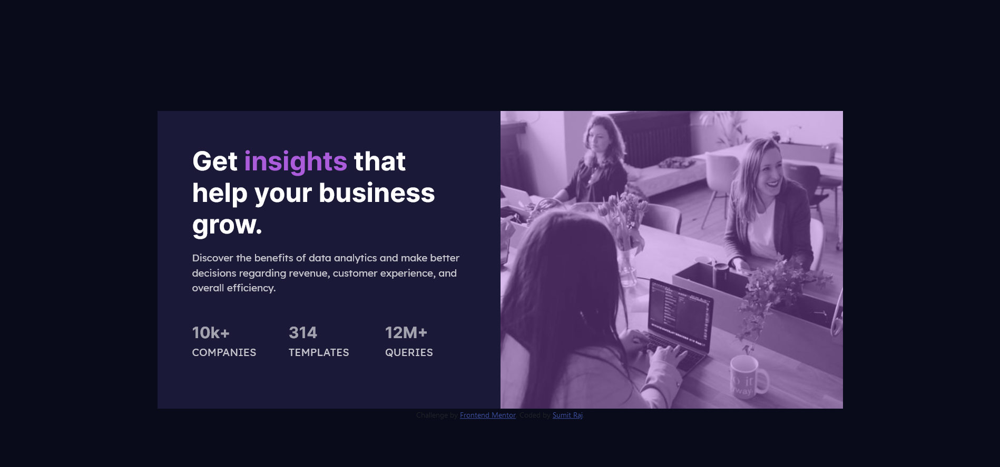

# Frontend Mentor - Stats preview card component solution

This is a solution to the [Stats preview card component challenge on Frontend Mentor](https://www.frontendmentor.io/challenges/stats-preview-card-component-8JqbgoU62). Frontend Mentor challenges help you improve your coding skills by building realistic projects.

## Table of contents

- [Overview](#overview)
  - [The challenge](#the-challenge)
  - [Screenshot](#screenshot)
  - [Links](#links)
- [My process](#my-process)
  - [Built with](#built-with)
  - [What I learned](#what-i-learned)
  - [Continued development](#continued-development)
  - [Useful resources](#useful-resources)
- [Author](#author)

## Overview

### The challenge

Users should be able to:

- View the optimal layout depending on their device's screen size

### Screenshot



### Links

- Solution URL: (https://github.com/sumit-raj-au5/Frontend_Mentor/tree/main/Stats_Preview)
- Live Site URL: (https://friendly-kilby-249d33.netlify.app/)

## My process

### Built with

- Semantic HTML5 markup
- CSS custom properties
- Flexbox
- CSS Grid
- Mobile-first workflow
- [Bootstrap](https://getbootstrap.com/) - For Styles

### What I learned

I learnt how to order colums for different screen sizes.

```html
<div class="col-md-6 rounded-md-end no-pad order-md-last overlay">
  
</div>

<div class="col-md-6 text rounded-md-start order-md-first">
  <h1>
    Get <span class="insight-color"> insights </span>that help your business
    grow.
  </h1>
</div>
```

I learnt how to overlay an image with a color

```css
.overlay {
  position: relative;
  display: flex;
  justify-content: center;
  align-items: center;
}

.overlay:before {
  content: "";
  display: block;
  position: absolute;
  top: 0;
  bottom: 0;
  left: 0;
  right: 0;
  background: hsl(277, 64%, 61%);
  opacity: 40%;
}
```

### Continued development

I am planning to focus on mobile first design and learn how to design UI by using Bootstrap, CSS and Tailwind.

### Useful resources

- [Column ordering](https://getbootstrap.com/docs/5.0/layout/columns/#order-classes) - This helped me to understand how to order columns differently for different screen size. It can be used to order columns other than normal flow.

## Author

- Website - [Sumit Raj](#)
- Frontend Mentor - [@sumit-raj-au5](https://www.frontendmentor.io/profile/sumit-raj-au5)
- Twitter - [@dev_sumit_raj](https://www.twitter.com/@dev_sumit_raj)
